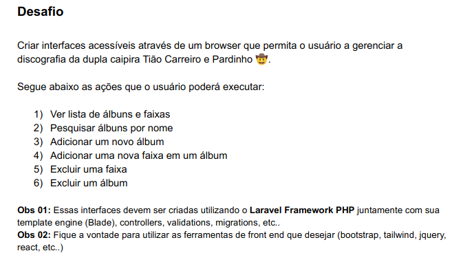
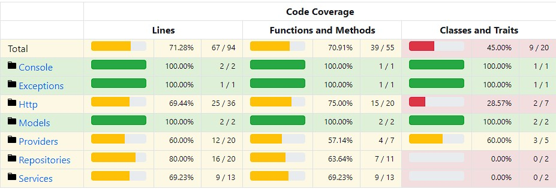

## Desafio

<p align="start"></a></p>


## Feramentas usada

**laravel sail**


<p>
O Laravel Sail é uma interface de linha de comando leve 
(assim como o artisan) e simples de usar. Seu foco é 
abstrair todo o uso do Docker para que seja mais simples 
durante o dia a dia.</p>

**bootstrap**
<p>
Bootstrap é um framework front-end que fornece estruturas de CSS para a criação de sites e aplicações responsivas de forma rápida e simples. Além disso, pode lidar com sites de desktop e páginas de dispositivos móveis da mesma forma.
</p>

## Testes unitários 
<p>
    Consegui atingir um total de 71.28% de cobertura de testes na minha aplicação, onde as funcionalidades principais ficaram com uma porcentagem maior de testes.
</p>
    Funcionalidades Testadas
<ul>
    <li>Ver lista de álbuns e faixas</li>
    <li>Pesquisar álbuns por nome</li>
    <li>Adicionar um novo álbum</li>
    <li>Adicionar uma nova faixa em um álbum</li>
    <li>Excluir uma faixa</li>
    <li>Excluir um álbum</li>
</ul>

## Como resolvi o teste
<p>
    Refatorei o meu codigo que havia feito antes, implementei o 
    Repository Pattern, onde ele é responsavel por se comunicar com o banco dados, criei interfaces para garantir que as classes do repository estão cumprindo o contrato da interface e implementando os metodos necessarios, implementei uma camada de Serviço, fazendo com que o controller fique o mais limpo possivel e cumpra sua função principal que é de apenas intermediar as requisições enviadas pelo View com as respostas. Implementei também testes unitários para garantir uma melhor segurança do código e que todas as funcionalidades estão funcionando corretamente. A baixo podemos ver uma porcentagem de cobertura do meu código atual.
</p>


## como instalar o projeto

**Primeiro Clone o projeto**

```
git clone https://github.com/figmateus/supliu-vaga.git
```

**Depois crie o .env**
```
 cp .env.example .env
 ```

 **Rode os comandos**
```
 composer update
 ./vendor/bin/sail build
 php artisan sail:install
 npm install 
 npm run dev
 ./vendor/bin/sail artisan key:generate
 ```

 **Configure o arquivo .env**
    <p align="start"></a></p>

 **Rode as migrations**
 ```
 ./vendor/bin/sail artisan migrate
 ```
 **Inicie o container**
 ```
 ./vendor/bin/sail up
 ```


