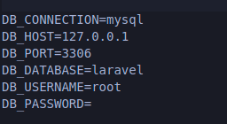

## Desafio

<p align="start"></a></p>


## Feramentas usada

**laravel sail**


<p>
O Laravel Sail é uma interface de linha de comando leve 
(assim como o artisan) e simples de usar. Seu foco é 
abstrair todo o uso do Docker para que seja mais simples 
durante o dia a dia.</p>

**bootstrap**
<p>
Bootstrap é um framework front-end que fornece estruturas de CSS para a criação de sites e aplicações responsivas de forma rápida e simples. Além disso, pode lidar com sites de desktop e páginas de dispositivos móveis da mesma forma.
</p>

## como instalar o projeto

**Primeiro Clone o projeto**

```
git clone https://github.com/figmateus/supliu-vaga.git
```

**Depois crie o .env**
```
 cp .env.example .env
 ```

 **Rode os comandos**
```
 composer update
 ./vendor/bin/sail build
 php artisan sail:install
 npm install 
 npm run dev
 ./vendor/bin/sail artisan key:generate
 ```

 **Configure o arquivo .env**
    <p align="start"></a></p>

 **Rode as migrations**
 ```
 ./vendor/bin/sail artisan migrate
 ```
 **Inicie o container**
 ```
 ./vendor/bin/sail up
 ```


